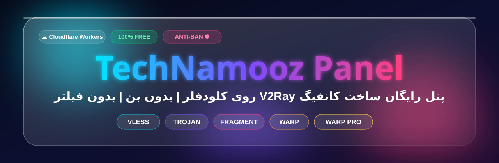
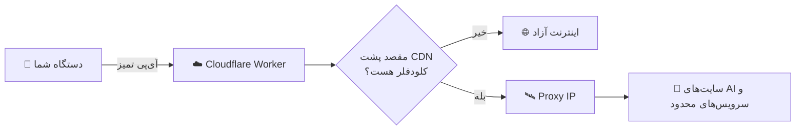
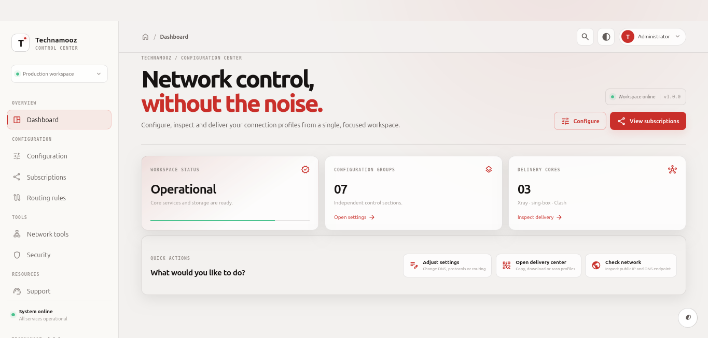
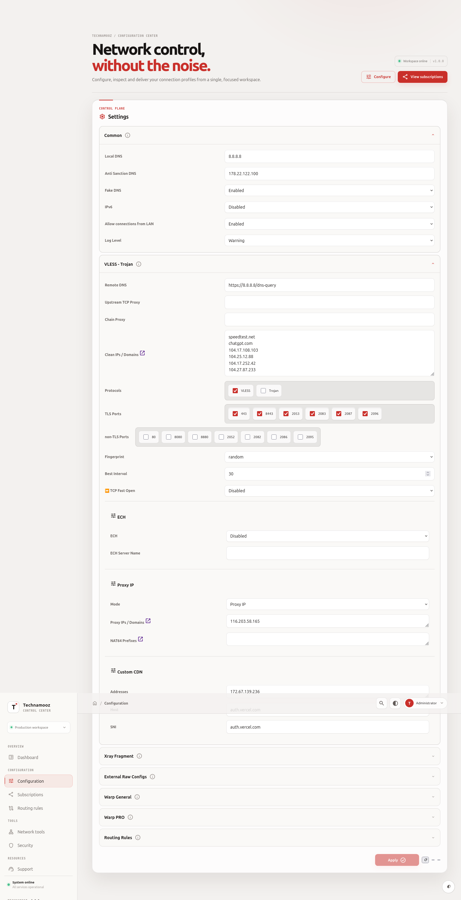

 

  

 

---

## 🚨 آپدیت بزرگ | مشکل «بن شدن اکانت کلودفلر» حل شد!

> بزرگ‌ترین دغدغه کاربران پنل‌های کلودفلر، **بن شدن اکانت** بود. 😰
> توی نسخه جدید یک **تکنیک ضد بن** پیاده‌سازی کردم که این مشکل رو برطرف می‌کنه. 🛡️

### 🎬 ویدیو جدید؛ حتماً کامل ببین

**▶️ روی تصویر کلیک کن؛ آموزش کامل نصب + توضیح تکنیک ضد بن ▶️**

> 📌 این ویدیو **جایگزین آموزش قبلی** شده. اگر نسخه قدیمی رو نصب کردی، حتماً با ویدیوی جدید آپدیت کن.

---

## 🤔 این پنل چیه؟

**پنل رایگان ساخت کانفیگ V2Ray روی Cloudflare** که بدون نیاز به سرور و بدون هزینه، در چند دقیقه راه‌اندازی میشه و:

| 🆓 رایگان | 🛡️ ضد بن | 🤖 بازکننده AI | ⚡ سریع |
|:---:|:---:|:---:|:---:|
| بدون هزینه و بدون سرور | تکنیک جدید برای جلوگیری از بن اکانت | ChatGPT، Claude، Gemini و ... | آی‌پی تمیز + WARP Pro |

---

## 🔥 چرا بین همه پنل‌ها، این یکی؟

| قابلیت | پنل‌های معمولی | 🚀 **پنل TechNamooz** |
|:---|:---:|:---:|
| رایگان و بدون سرور | ✅ | ✅ |
| **تکنیک ضد بن اکانت** | ❌ | ✅ |
| باز شدن سایت‌های **هوش مصنوعی** | ❌ | ✅ |
| سیستم **Proxy IP** (لوکیشن ثابت) | ❌ | ✅ |
| استفاده از **آی‌پی تمیز** با اسکنر | ⚠️ | ✅ |
| سابسکریپشن **Fragment** | ⚠️ | ✅ |
| **WARP** و **WARP Pro** | ❌ | ✅ |
| سابسکریپشن **Raw** | ❌ | ✅ |
| پروتکل **VLESS** و **Trojan** | ⚠️ | ✅ |
| آموزش کامل ویدیویی | ❌ | ✅ |

---

## 🤖 باز شدن سایت‌های هوش مصنوعی

| 🤖 ChatGPT | 🧠 Claude | ✨ Gemini | 🔎 Perplexity | 🧩 Copilot |
|:---:|:---:|:---:|:---:|:---:|
| ✅ | ✅ | ✅ | ✅ | ✅ |

**و سایر سایت‌های هوش مصنوعی و سرویس‌های محدود...** 🌍

### 🛰️ راز کار؛ سیستم Proxy IP

کلودفلر به‌تنهایی **نمی‌تونه به سایت‌هایی که خودشون پشت CDN کلودفلر هستن وصل بشه**. برای همین پنل از **Proxy IP** استفاده می‌کنه تا:

- 📍 **لوکیشن ثابت** بمونه
- 🤖 سایت‌های هوش مصنوعی و سرویس‌هایی که با کانفیگ عادی باز نمیشن، **باز بشن**
- 💾 آی‌پی‌ها **داخل پنل ذخیره** بشن و هر بار نیازی به تنظیم دوباره نباشه

---

## 🔍 آی‌پی تمیز + اسکنر

برای بهترین سرعت، پنل از **آی‌پی‌های تمیز Cloudflare** استفاده می‌کنه:

1. 🔎 با **اسکنر آی‌پی** آی‌پی‌های تمیز رو پیدا کن
2. 📋 داخل **پنل** وارد کن
3. ⚡ کانفیگ‌ها با بهترین آی‌پی‌ها ساخته میشن

**🔍 آموزش اسکن آی‌پی تمیز**

> 💡 هر اپراتور آی‌پی تمیز مخصوص خودش رو داره؛ اسکن رو با همون اینترنتی که استفاده می‌کنی انجام بده.

---

## 🖼️ نگاهی به پنل

 

 

---

## 📦 ۵ نوع سابسکریپشن

| نوع | توضیح | مناسب برای |
|:---:|:---|:---|
| 🟢 **Normal** | استاندارد و پایدار | استفاده روزمره |
| ⚪ **Raw** | کانفیگ‌های خام | کاربران حرفه‌ای |
| 🧩 **Fragment** | عبور از فیلترینگ با شکستن بسته‌ها | اپراتورهای سخت‌گیر |
| 🌐 **WARP** | اتصال از طریق Cloudflare WARP | پایداری بیشتر |
| 💎 **WARP Pro** | نسخه پیشرفته WARP | بهترین کیفیت و سرعت |

---

## 📱 معرفی کلاینت‌ها | روی همه سیستم‌عامل‌ها

> برای اتصال، یکی از کلاینت‌های زیر رو نصب کن و لینک سابسکریپشن رو واردش کن.

| کلاینت | 🤖 Android | 🍎 iOS | 🪟 Windows | 🍏 macOS | 🐧 Linux |
|:---|:---:|:---:|:---:|:---:|:---:|
| [**v2rayNG**](https://github.com/2dust/v2rayNG) | ✅ | ❌ | ❌ | ❌ | ❌ |
| [**Hiddify**](https://github.com/hiddify/hiddify-app) | ✅ | ✅ | ✅ | ✅ | ✅ |
| **v2rayTun** | ✅ | ✅ | ❌ | ❌ | ❌ |
| **V2Box** | ✅ | ✅ | ❌ | ✅ | ❌ |
| **Happ** | ✅ | ✅ | ✅ | ✅ | ❌ |
| **Streisand** | ❌ | ✅ | ❌ | ✅ | ❌ |
| **Shadowrocket** (پولی) | ❌ | ✅ | ❌ | ❌ | ❌ |
| [**v2rayN**](https://github.com/2dust/v2rayN) | ❌ | ❌ | ✅ | ❌ | ✅ |
| [**Karing**](https://github.com/KaringX/karing) | ✅ | ✅ | ✅ | ✅ | ✅ |
| [**Clash Verge Rev**](https://github.com/clash-verge-rev/clash-verge-rev) | ❌ | ❌ | ✅ | ✅ | ✅ |
| [**v2rayA**](https://github.com/v2rayA/v2rayA) | ❌ | ❌ | ❌ | ❌ | ✅ |
| **NekoBox** | ✅ | ❌ | ❌ | ❌ | ❌ |

### ⭐ پیشنهاد من برای هر پلتفرم

| پلتفرم | بهترین انتخاب‌ها |
|:---:|:---|
| 🤖 **اندروید** | v2rayNG · Hiddify · v2rayTun · Happ |
| 🍎 **آیفون / آیپد** | Streisand · V2Box · Happ · v2rayTun |
| 🪟 **ویندوز** | v2rayN · Hiddify · Happ |
| 🍏 **مک** | Streisand · V2Box · Hiddify · Happ |
| 🐧 **لینوکس** | Hiddify · v2rayA · v2rayN |

> ⚠️ **نکته:** پشتیبانی هر کلاینت از انواع سابسکریپشن (Fragment، WARP، Raw) فرق داره. اگر یکی کار نکرد، کلاینت دیگه‌ای رو امتحان کن. جدول تست‌شده‌ها رو در ویدیو توضیح دادم.

---

## 🛠️ راه‌اندازی سریع

> 🎬 **مراحل کامل و تصویری در [ویدیو جدید](https://youtu.be/mlfy-sTL3Lo) توضیح داده شده.**

1. وارد [Cloudflare](https://dash.cloudflare.com) شو
2. یک Worker جدید بساز
3. کد پروژه رو قرار بده و تنظیمات رو طبق ویدیو انجام بده
4. آی‌پی تمیز (با اسکنر) و Proxy IP رو داخل پنل تنظیم کن
5. سابسکریپشن دلخواه رو کپی کن و داخل کلاینت وارد کن 🎉

---

## ❓ سوالات متداول

<b>🛡️ تکنیک ضد بن چیه؟</b>

 
نسخه جدید با یک تکنیک تازه ساخته شده که مشکل بن شدن اکانت رو برطرف می‌کنه. توضیح کامل در <a href="https://youtu.be/mlfy-sTL3Lo">ویدیو جدید</a>. پیشنهاد می‌کنم دقیقاً طبق ویدیو پیش برید.

<b>🖥️ سرور شخصی لازمه؟</b>

 
نه، همه چیز روی Cloudflare اجرا میشه و رایگانه.

<b>🤖 چرا سایت‌های هوش مصنوعی باز نمیشن؟</b>

 
بخش <b>Proxy IP</b> رو داخل پنل تنظیم کن؛ این بخش دقیقاً برای همین کاره.

<b>🐌 سرعت پایینه!</b>

 
با اسکنر، آی‌پی تمیز جدید پیدا کن. اگر هنوز کند بود، <b>Fragment</b> یا <b>WARP Pro</b> رو تست کن.

<b>📦 کدوم سابسکریپشن رو انتخاب کنم؟</b>

 
از <b>Normal</b> شروع کن؛ اگر وصل نشد، <b>Fragment</b> و بعد <b>WARP Pro</b> رو امتحان کن.

<b>🔑 کلمات کلیدی</b>

 
پنل رایگان V2Ray، ساخت کانفیگ رایگان، پنل کلودفلر، Cloudflare Workers V2Ray، کانفیگ VLESS، کانفیگ Trojan، سابسکریپشن Fragment، WARP Pro، پروکسی آی‌پی، آی‌پی تمیز کلودفلر، اسکنر آی‌پی تمیز، باز کردن ChatGPT، باز کردن Claude، باز کردن Gemini، ضد بن کلودفلر، ضد فیلتر، کلاینت v2rayNG، Hiddify، آموزش نصب پنل.

---

## 🌐 ارتباط با من

<table>
<tr>
<td align="center"></td>
<td align="center"></td>
</tr>
<tr>
<td align="center"></td>
<td align="center"></td>
</tr>
</table>

### 💬 پشتیبانی و پاسخ به سوالات

---

## 💖 حمایت از پروژه

- ⭐ به ریپازیتوری **Star** بده
- 🔔 کانال یوتیوب رو **سابسکرایب** کن
- 📢 به دوستانت معرفی کن
- 🐞 باگ‌ها رو در Issues یا پشتیبانی تلگرام گزارش بده

## ⚠️ سلب مسئولیت

این پروژه صرفاً با هدف **آموزشی و دسترسی آزاد به اطلاعات** ارائه شده است. مسئولیت نحوه استفاده و رعایت قوانین محل زندگی و قوانین سرویس‌دهندگان (از جمله Cloudflare) بر عهده کاربر است.

### ⭐ اگر دوستش داشتی، یک Star فراموش نشه! ⭐

**ساخته‌شده با ❤️ توسط [TechNamooz](https://youtube.com/@technamooz)**

