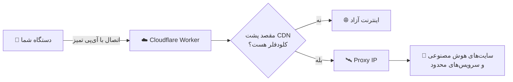

 

 

---

## 🤯 قبل از هر چیز، یک سوال!

> **تا حالا شده کانفیگ بسازی، وصل بشی، ولی ChatGPT و Claude و Gemini همچنان باز نشن؟** 😤

دلیلش اینه که **Cloudflare خودش نمی‌تونه به سایت‌هایی که پشت همین CDN هستن وصل بشه** و اکثر پنل‌ها این مشکل رو اصلاً حل نمی‌کنن.

### 💥 ما حلش کردیم.

این پروژه با ترکیب **آی‌پی تمیز Cloudflare** و **سیستم هوشمند Proxy IP**، دسترسی به **سایت‌های هوش مصنوعی** و سرویس‌هایی رو باز می‌کنه که با کانفیگ‌های معمولی هیچ‌وقت بازشون نمی‌شد.

### 🎬 ویدیو معرفی و آموزش کامل

**👆 روی تصویر کلیک کن و آموزش قدم‌به‌قدم رو ببین 👆**

---

## 🔥 چرا این پنل با بقیه فرق داره؟

| | پنل‌های معمولی | 🚀 **پنل TechNamooz** |
|:---|:---:|:---:|
| اجرا روی Cloudflare بدون سرور | ✅ | ✅ |
| باز شدن سایت‌های هوش مصنوعی | ❌ | ✅ |
| سیستم **Proxy IP** برای ثابت‌کردن لوکیشن | ❌ | ✅ |
| استفاده از **آی‌پی تمیز** با اسکنر | ⚠️ | ✅ |
| سابسکریپشن **Fragment** | ⚠️ | ✅ |
| **WARP** و **WARP Pro** | ❌ | ✅ |
| سابسکریپشن **Raw** برای حرفه‌ای‌ها | ❌ | ✅ |
| پنل گرافیکی و ساده | ⚠️ | ✅ |
| آموزش کامل ویدیویی | ❌ | ✅ |

---

## 🤖 سرویس‌هایی که باز می‌شن

| 🤖 ChatGPT | 🧠 Claude | ✨ Gemini | 🔎 Perplexity | 🧩 Copilot |
|:---:|:---:|:---:|:---:|:---:|
| ✅ | ✅ | ✅ | ✅ | ✅ |

**و تمام سایت‌های هوش مصنوعی دیگه...** 🌍

---

## 🖼️ نگاهی به پنل

 

 

*✨ رابط کاربری مدرن، سریع و کاملاً حرفه‌ای ✨*

---

## 🧠 پشت صحنه چطور کار می‌کنه؟

**ساده بگیم:** کلودفلر به‌تنهایی نمی‌تونه سایت‌هایی که خودشون پشت کلودفلر هستن رو نمایش بده. پس مسیر این ترافیک‌ها از **Proxy IP** عبور می‌کنه و همین باعث میشه هم **لوکیشن ثابت بمونه** و هم سایت‌های هوش مصنوعی بدون مشکل باز بشن. 😎

---

## 🛰️ بخش Proxy IP | قلب پروژه

| ویژگی | توضیح |
|:---|:---|
| 📍 **ثابت‌کردن لوکیشن** | آی‌پی خروجی شما ثابت می‌مونه |
| 🤖 **دسترسی به هوش مصنوعی** | سایت‌هایی که با کانفیگ عادی باز نمی‌شن، باز می‌شن |
| 🌐 **عبور از محدودیت CDN** | مشکل سایت‌های پشت کلودفلر حل میشه |
| 💾 **ذخیره‌سازی** | آی‌پی‌ها در پنل ذخیره میشن و هر بار نیازی به تنظیم دوباره نیست |
| 🎛️ **مدیریت ساده** | از داخل پنل اضافه، حذف و تغییر بده |

---

## 🔍 آی‌پی تمیز + اسکنر | راز سرعت بالا

این پروژه برای اتصال از **آی‌پی‌های تمیز Cloudflare** استفاده می‌کنه. مراحل کار:

1. 🔎 با **اسکنر آی‌پی** آی‌پی‌های تمیز و سالم رو پیدا می‌کنی
2. 📋 آی‌پی‌های پیدا شده رو داخل **پنل** وارد می‌کنی
3. ⚡ کانفیگ‌ها با بهترین آی‌پی‌ها ساخته میشن، سرعت و پایداری بالاتر

**🔍 آموزش کامل اسکن آی‌پی تمیز رو اینجا ببین 👆**

> 💡 **نکته طلایی:** هر اپراتور آی‌پی تمیز مخصوص خودش رو داره. اسکن رو با اینترنت خودت انجام بده تا بهترین نتیجه رو بگیری.

---

## 📦 ۵ نوع سابسکریپشن، یک پنل

| نوع | توضیح | مناسب برای |
|:---:|:---|:---|
| 🟢 **Normal** | سابسکریپشن استاندارد و پایدار | استفاده روزمره |
| ⚪ **Raw** | کانفیگ‌های خام و بدون تغییر | کاربران حرفه‌ای |
| 🧩 **Fragment** | شکستن بسته‌ها برای عبور از فیلترینگ | اپراتورهای سخت‌گیر |
| 🌐 **WARP** | اتصال از طریق Cloudflare WARP | پایداری و آی‌پی تمیز |
| 💎 **WARP Pro** | نسخه پیشرفته و بهینه WARP | بهترین کیفیت و سرعت |

**🛡️ پروتکل‌ها:** `VLESS` · `Trojan`

---

## 🛠️ نصب و راه‌اندازی

> 🎬 **توصیه می‌کنم حتماً ویدیوی آموزشی رو ببینی؛ همه مراحل رو کامل و تصویری توضیح دادم.**

**۱.** وارد [Cloudflare](https://dash.cloudflare.com) شو (ثبت‌نام رایگانه).

**۲.** از بخش **Workers & Pages** یک Worker جدید بساز.

**۳.** کد پروژه رو داخل Worker قرار بده.

**۴.** متغیرهای مورد نیاز (مثل `UUID` و رمز پنل) رو در **Settings → Variables** تنظیم کن.

**۵.** **Deploy** رو بزن و آدرس پنل رو باز کن.

**۶.** آی‌پی‌های تمیز رو (با اسکنر) و Proxy IP رو داخل پنل تنظیم کن.

**۷.** سابسکریپشن دلخواه رو کپی کن و داخل اپ وارد کن. **تمام!** 🎉

---

## 📱 اپلیکیشن‌های پیشنهادی

| پلتفرم | اپلیکیشن |
|:---:|:---|
| 🤖 Android | v2rayNG · Hiddify · NekoBox |
| 🍎 iOS | Streisand · V2Box · Shadowrocket |
| 🪟 Windows | v2rayN · Hiddify · Nekoray |
| 🍏 macOS | V2Box · Hiddify · Streisand |

---

## ❓ سوالات متداول

<b>🖥️ آیا سرور شخصی لازمه؟</b>

 
نه! همه چیز روی Cloudflare اجرا میشه.

<b>🤖 چرا سایت‌های هوش مصنوعی باز نمیشن؟</b>

 
بخش <b>Proxy IP</b> رو داخل پنل تنظیم کن. این بخش دقیقاً برای حل همین مشکله.

<b>🐌 سرعت پایینه، چیکار کنم؟</b>

 
با اسکنر آی‌پی تمیز جدید پیدا کن و داخل پنل بذار. اگر باز هم کند بود، سابسکریپشن <b>Fragment</b> یا <b>WARP Pro</b> رو امتحان کن.

<b>📦 کدوم سابسکریپشن رو انتخاب کنم؟</b>

 
از <b>Normal</b> شروع کن؛ اگر وصل نشد، به ترتیب <b>Fragment</b> و بعد <b>WARP Pro</b> رو تست کن.

---

## 💖 حمایت از پروژه

اگر این پنل برات مفید بود، با کارهای زیر خیلی بهم کمک می‌کنی:

- ⭐ به این ریپازیتوری **Star** بده
- 🔔 کانال یوتیوب رو **سابسکرایب** کن
- 📢 با دوستات به اشتراک بذار
- 🐞 باگ‌ها رو در **Issues** گزارش بده

---

## 🌐 من رو دنبال کن

---

## ⚠️ سلب مسئولیت

این پروژه صرفاً با هدف **آموزشی و دسترسی آزاد به اطلاعات** ارائه شده است. مسئولیت نحوه استفاده و رعایت قوانین محل زندگی بر عهده خود کاربر است.

### ⭐ اگر دوستش داشتی، یک Star فراموش نشه! ⭐

**ساخته‌شده با ❤️ توسط [TechNamooz](https://youtube.com/@technamooz)**

